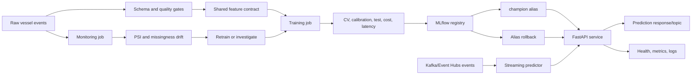

# Enterprise MLOps Architecture Capstone

## 1. Executive Summary

This project is a production-oriented vessel-delay prediction platform. It predicts whether a vessel will be delayed by more than two hours and operates as a complete MLOps system:

```text
Data contract
  -> quality validation
  -> feature engineering
  -> time-aware training
  -> threshold and business-cost evaluation
  -> MLflow experiment tracking
  -> immutable model registry versions
  -> champion alias promotion
  -> FastAPI and Kafka inference
  -> drift, quality, latency, and reliability monitoring
  -> controlled rollback and retraining
```

The platform is container-first and cloud-neutral. The same image and environment contract can run locally, on Azure, AWS, or GCP.

## 2. Business Problem

Port operations need early warning when a vessel is likely to be delayed. Missing a delay is more expensive than raising an unnecessary alert, so the system optimizes an operating threshold using explicit business costs:

```text
business cost = false positives * 1.0 + false negatives * 5.0
```

The current champion is Logistic Regression because it meets the recall floor and has the lowest observed business cost while remaining fast and interpretable.

## 3. Architecture



### Component ownership

| Component | Responsibility |
|---|---|
| `src/data_validation.py` | Hard data-contract validation |
| `src/data_quality.py` | Quality evidence and batch status |
| `src/feature_store.py` | Versioned feature contract and hash |
| `src/feature_engineering.py` | Shared offline/online feature transformation |
| `src/train.py` | Candidate training, evaluation, registration, and promotion |
| `src/mlflow_registry.py` | Runs, versions, aliases, rollback, and model loading |
| `api/main.py` | HTTP inference, probes, metrics, and fallback loading |
| `monitoring/monitor.py` | Quality, drift, summaries, and alert exit codes |
| `streaming/kafka_predictor.py` | Optional real-time event inference |
| `src/retrain.py` | Guarded automated retraining entry point |

## 4. Data and Feature Governance

The prediction grain is one vessel arrival event. The target is `delayed`, where `1` means delay greater than two hours.

The feature contract records:

- Numeric and categorical inputs
- Derived feature rules
- Feature version
- Deterministic SHA-256 contract hash

Training persists the contract hash with artifacts and MLflow versions. Serving recomputes the runtime hash and fails readiness on a known mismatch. This prevents a model trained against one feature definition from silently serving against another.

## 5. Model Development Lifecycle

The pipeline uses:

- Chronological 70% train, 10% calibration, and 20% untouched test split.
- Time-series cross-validation when timestamps exist.
- Stratified fallback only when timestamps are unavailable.
- Logistic Regression baseline.
- Random Forest challenger.
- XGBoost challenger.
- Calibration-only threshold tuning.
- Business-cost, recall, quality, slice, and latency evaluation.
- MLflow registration for every candidate.

Promotion requires the candidate to satisfy recall, F1, ROC-AUC, PR-AUC, business-cost, and P95 latency constraints. Registration does not imply approval.

## 6. Current Model Decision

Latest local evidence:

| Model | Recall | F1 | ROC-AUC | PR-AUC | Business cost | Decision |
|---|---:|---:|---:|---:|---:|---|
| Logistic Regression | 0.875 | 0.649 | 0.804 | 0.697 | 508 | Champion |
| Random Forest | 0.866 | 0.634 | 0.790 | 0.656 | 539 | Challenger |
| XGBoost | 0.812 | 0.630 | 0.781 | 0.669 | 599 | Rejected by recall/cost policy |

The production alias points to the approved MLflow version, while local `models/champion.joblib` provides a fallback when the registry is unavailable.

## 7. Model Registry and Release Governance

```text
candidate run
  -> immutable model version
  -> validation_status=candidate
  -> promotion gate
  -> validation_status=approved
  -> champion alias
```

Every version records run ID, artifact URI, feature hash, project version, threshold, cost, recall, F1, and lineage tags.

Rollback is an alias operation. A previously approved version can become champion without rebuilding the artifact. Rollbacks require a reason and are recorded in model-version tags.

## 8. Serving and Reliability

FastAPI provides:

- `/health`: process and model identity
- `/ready`: readiness, model identity, and feature-contract match
- `/metrics`: uptime, traffic, errors, latency, and registry version
- `/predict`: validated probability and thresholded delay status

The service:

- Uses the MLflow champion alias first.
- Falls back to the local champion artifact.
- Uses typed request and response models.
- Emits request IDs.
- Tracks in-process latency and error metrics.
- Returns HTTP 503 when a model or feature contract is unavailable.

For production, export process-local telemetry to a centralized observability platform.

## 9. Monitoring and SRE

Monitoring produces a machine-readable report with:

- Data-quality status
- PSI distribution drift
- Missingness drift
- Unavailable feature detection
- High and medium drift summaries
- UTC report timestamp
- `PASS`, `WARN`, or `ALERT` status

`--fail-on-alert` returns exit code `2`, allowing schedulers and CI/CD to stop unsafe workflows.

Recommended SLOs:

- Readiness success rate
- API error rate
- P95/P99 latency
- Prediction availability
- Registry load success
- Kafka consumer lag
- Monitoring freshness
- Feature contract match

## 10. Automated Retraining

Retraining is guarded rather than blindly triggered by drift:

```text
monitor
  -> investigate quality/drift
  -> freeze dataset version
  -> retrain candidates
  -> evaluate and register
  -> promotion gate
  -> promote or retain champion
```

The retraining command blocks on `ALERT` unless explicitly overridden with a documented reason. Each run writes a retraining audit record.

## 11. Real-Time Streaming

The optional Kafka adapter provides at-least-once prediction processing:

```text
vessel-events
  -> consumer group
  -> shared prediction callback
  -> vessel-delay-predictions
```

Production requirements:

- TLS and SASL or managed identity.
- Stable consumer group.
- Manual offset commits after successful output publication.
- Dead-letter handling.
- Event IDs for idempotency.
- Model version included in every output event.
- Consumer lag and rebalance monitoring.

## 12. Container Architecture

Docker Compose defines:

| Service | Role |
|---|---|
| `api` | Long-running prediction service |
| `train` | One-shot training and registration job |
| `monitor` | One-shot quality and drift job |
| `mlflow` | Optional local registry server |

The image runs as a non-root user. Named volumes persist MLflow, models, and reports. Cloud deployment replaces local volumes with durable provider storage.

## 13. Cloud Portability

| Concern | Azure | AWS | GCP |
|---|---|---|---|
| API | Container Apps | ECS/Fargate | Cloud Run |
| Training | Container Apps Job / Azure ML | Batch / ECS task | Cloud Run Job / Vertex AI |
| Object store | Blob Storage | S3 | GCS |
| Registry DB | Azure Database for PostgreSQL | RDS PostgreSQL | Cloud SQL PostgreSQL |
| Kafka | Event Hubs Kafka endpoint | MSK | Managed Kafka |
| Secrets | Key Vault | Secrets Manager | Secret Manager |
| Identity | Managed identity | Task role | Service account |
| Observability | Azure Monitor | CloudWatch | Cloud Monitoring |

Provider-specific templates are under `deploy/`, while the Python code uses standard environment variables and HTTP probes.

## 14. Security Model

- No credentials in source or images.
- Managed identity, task roles, or service accounts.
- Read-only serving access to models.
- Restricted registry writes for training/release identities.
- TLS for API, registry, database, storage, and messaging.
- Private networking for control-plane services.
- Secret-manager references in deployment configuration.
- Audit trails for promotion, rollback, retraining, and monitoring decisions.

## 15. Interview-Ready Design Answers

### Why time-aware splitting?

Vessel operations are temporal. Random mixing can leak future operating regimes into training and inflate test metrics. Chronological splitting better simulates deployment.

### Why tune the threshold separately from the model?

The classifier ranks risk; the threshold encodes business cost. Separating them allows operations to change the alert policy without retraining the model, while still requiring documented calibration evidence.

### Why use MLflow aliases?

Numeric versions are immutable artifacts. The alias is the stable deployment contract, enabling promotion and rollback without changing serving code.

### Why keep a local fallback?

Registry outages should not automatically take down inference. The fallback maintains availability, while health and observability expose that the service is no longer registry-backed.

### Why block retraining on an alert?

Drift can indicate a source-system defect rather than a real model problem. Blind retraining can encode corrupted data and make the incident worse.

### Why Kafka instead of putting streaming inside FastAPI?

HTTP serving and event processing have different scaling, retry, and backpressure characteristics. Separating them keeps the API responsive and lets Kafka consumer groups scale independently.

### What is still needed for full enterprise production?

- Managed cloud deployment and network topology.
- Centralized metrics and logs.
- Real load and chaos testing.
- Matured-label performance monitoring.
- Key rotation and policy enforcement.
- CI/CD image signing and vulnerability scanning.
- Formal data retention, access, and disaster-recovery policies.

## 16. Validation Evidence

The repository’s current validation evidence includes:

- Full Python test suite passing with 24 tests.
- Feature-contract hash matching persisted training metadata.
- MLflow candidate registration and champion alias promotion.
- Drift monitoring self-comparison returning `PASS`.
- Docker Compose profiles validating successfully.
- AWS ECS task definition JSON validating successfully.
- Azure, AWS, and GCP migration artifacts present.

Docker image execution remains dependent on a running Docker Desktop or cloud build environment.
